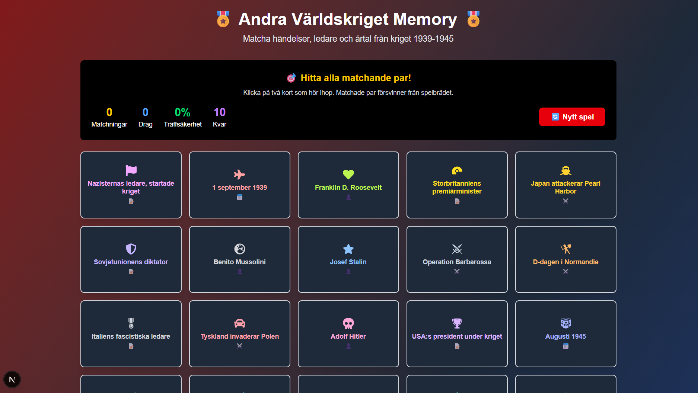
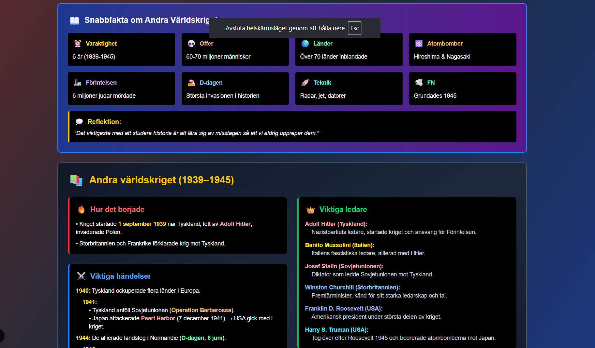

# 🧠 Memory för pluggande

> **Interaktiva memory-spel för att förbättra inlärning och minne**

En samling pedagogiska memory-spel utvecklade för att stödja elever med olika inlärningsbehov. Spelen kombinerar visuellt lärande med interaktiv spelmekanik för att göra studier både roliga och effektiva.

[](https://nextjs.org/)
[](https://www.typescriptlang.org/)
[](https://tailwindcss.com/)
[](https://opensource.org/licenses/MIT)

## 🎯 Syfte och målgrupp

Utvecklat speciellt för att stödja elever med:
- **ADHD** - Visuell stimulering och fokuserat lärande
- **Språkstörning** - Multimodalt lärande med visuella hjälpmedel
- **Inlärningssvårigheter** - Flexibel hastighet utan tidspress
- **Allmän memorering** - Förberedelse inför prov och läxförhör

## ✨ Spelöversikt

### 🎖️ Andra världskriget
Matcha viktiga händelser, ledare och årtal från 1939-1945
- **20 kort** med historiska fakta
- **Detaljerade faktarutor** med pedagogiskt innehåll
- **Visuell färgkodning** för olika kategorier

### 🧪 Kemi - Atomer
Lär dig atomens uppbyggnad och det periodiska systemet
- **Begrepp och definitioner** om atomer
- **Grupper och perioder** i periodiska systemet
- **Snabbfakta** för repetition

## 📸 Screenshots

| Spelvy | Faktarutor |
|--------|------------|
|   |  |

## 🚀 Kom igång

### Förutsättningar
- Node.js 18.17 eller senare
- npm eller yarn

### Installation

```bash
# Klona repositoriet
git clone https://github.com/knixan/memory-for-studdy.git

# Navigera till projektmappen
cd memory-for-studdy

# Installera beroenden
npm install

# Starta utvecklingsservern
npm run dev
```

### 🌐 Öppna spelet
Navigera till [http://localhost:3000](http://localhost:3000) i din webbläsare.

## 🛠️ Teknisk stack

### Frontend
- **Next.js 15** - React-ramverk med App Router
- **TypeScript** - Typsäkerhet och förbättrad utvecklarupplevelse
- **Tailwind CSS** - Utility-first CSS-ramverk
- **React Icons** - Ikonbibliotek för visuell förstärkning

### Utvecklingsverktyg
- **ESLint** - Kodkvalitet och konventioner
- **PostCSS** - CSS-bearbetning
- **Turbopack** - Snabb bundling för utveckling

## 🎮 Spelets funktioner

### 🎯 Pedagogiska fördelar
- **Visuellt lärande** - Ikoner och färger stödjer förståelse
- **Repetition** - Naturlig memorering genom spelmekanik
- **Omedelbar feedback** - Direkt respons på rätt/fel svar
- **Egen takt** - Ingen tidspress eller stress

### 🔧 Tekniska funktioner
- **Responsiv design** - Fungerar på desktop, tablet och mobil
- **Tillgänglighetsoptimerad** - Stora klickytor och tydliga kontraster
- **Progressionsspårning** - Statistik för framsteg och förbättring
- **Modulär arkitektur** - Enkel att utöka med nya spel

### 📊 Spelstatistik
- Antal matchningar
- Totala drag
- Träffsäkerhet i procent
- Återstående par

## 🎓 Användningsområden

### För lärare
- **Klassrumsaktiviteter** - Interaktiv inlärning i grupp
- **Provförberedelse** - Rolig repetition av kursmaterial
- **Differentierad undervisning** - Anpassning för olika behov
- **Hemuppgifter** - Engagerande alternativ till traditionella övningar

### För elever
- **Självständig träning** - Öva hemma i egen takt
- **Stressreducering** - Lekfullt lärande minskar prestationsångest
- **Minnesutveckling** - Träna koncentration och fokus
- **Motivationshöjning** - Spelifiering gör lärande roligt

### Utvecklingsprocess
1. Forka repositoriet
2. Skapa en feature-branch (`git checkout -b feature/amazing-feature`)
3. Commita dina ändringar (`git commit -m 'Add amazing feature'`)
4. Pusha till branchen (`git push origin feature/amazing-feature`)
5. Öppna en Pull Request

### Rapportera buggar
Använd [GitHub Issues](https://github.com/knixan/memory-for-studdy/issues) för att rapportera buggar eller föreslå nya funktioner.

## 📄 Licens

Detta projekt är licensierat under MIT-licensen - se [LICENSE](LICENSE) filen för detaljer.

## 👩‍💻 Skapare

**Joefine Eriksson**
- 🌐 Webbplats: [kodochdesign.se](https://kodochdesign.se)
- 📧 E-post: [info@kodochdesign.se](mailto:info@kodochdesign.se)
- 🐙 GitHub: [@knixan](https://github.com/knixan)

## 🙏 Erkännanden

- **Egen erfarenhet av hur barn och ungdommar med ADHD och Spårkstörning behöver ampassad undervisning. 

---

<div align="center">

**"Lärande ska vara tillgängligt för alla - oavsett förutsättningar"**

[](https://github.com/knixan/memory-for-studdy/stargazers)
[](https://github.com/knixan)

</div>
